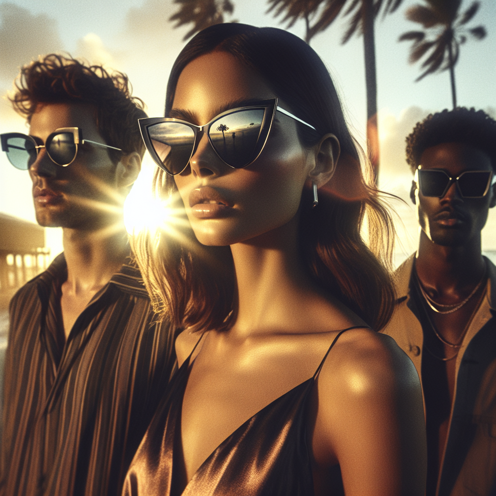

# 🕶️ Summer Sunglasses Campaign – Executive Summary

## 📊 Refined Trend Insights
Executive Briefing: Summer 2025 Sunglasses Trends  
Date: November 7, 2025

Overview  
As we prepare our summer campaign, three key silhouettes dominate both runway and street-style conversations: Aviator, Cat-Eye and Oversized/Square Acetate. Each style carries its own heritage appeal and commercial potential, ensuring broad consumer resonance.

Trend Highlights  
1. Aviator (“High-Flyer”)  
   • Metal frame with teardrop lenses – iconic, runway-endorsed (Chanel, Lacoste)  
   • Excellent UV coverage, lightweight construction for all-day comfort  
   • Catalog SKU: SG001 | Price: \$103 | Inventory: 23 units  

2. Cat-Eye (“Glamour”)  
   • Up-swept acetate frame with optional embellishments – ’50s-inspired femininity  
   • Pairs seamlessly with summer dresses and resort attire  
   • Catalog SKU: SG003 “Mystique” | Price: \$88 | Inventory: 3 units  

3. Oversized/Square Acetate (“Bold Move”)  
   • Thick rims and angular lenses – strong unisex statement piece  
   • Retro-modern edge elevates both casual and streetwear looks  
   • Catalog SKU: SG002 “Wayfarer” | Price: \$92 | Inventory: 6 units  

Strategic Rationale  
– The Aviator revival continues to gain momentum on fashion’s biggest runways. SG001 leverages this demand with a premium, performance-driven offering.  
– The Cat-Eye silhouette is experiencing a resurgence among style-minded consumers seeking a refined, feminine look. SG003 captures that spirit in a competitively priced acetate option.  
– Oversized, square frames remain a street-style staple, appealing to both men and women. SG002’s bold profile aligns perfectly with urban summer wardrobes.

Recommendation  
Launch a focused capsule collection featuring all three staples. Position as:  
• High-Flyer Aviator for classicists  
• Glamour Mystique Cat-Eye for trendsetters  
• Bold Move Wayfarer for statement-seekers  

This curated trio will cover the top runway and street trends, maximize consumer appeal, and drive seasonal sales growth.

## 🎯 Campaign Visual

    

## ✍️ Campaign Quote
Golden-hour glamour: aviator, cat-eye, and oversized shades for every style

## ✅ Why This Works
This line mirrors the image’s sunlit, sunset setting and spotlights all three Summer ’25 trends—Aviator’s timeless metal frames, Mystique’s feminine Cat-Eye revival, and the bold Wayfarer-style acetate—inviting every customer to embrace seasonal style under the golden horizon.

---

*Report generated on 2025-11-07*
