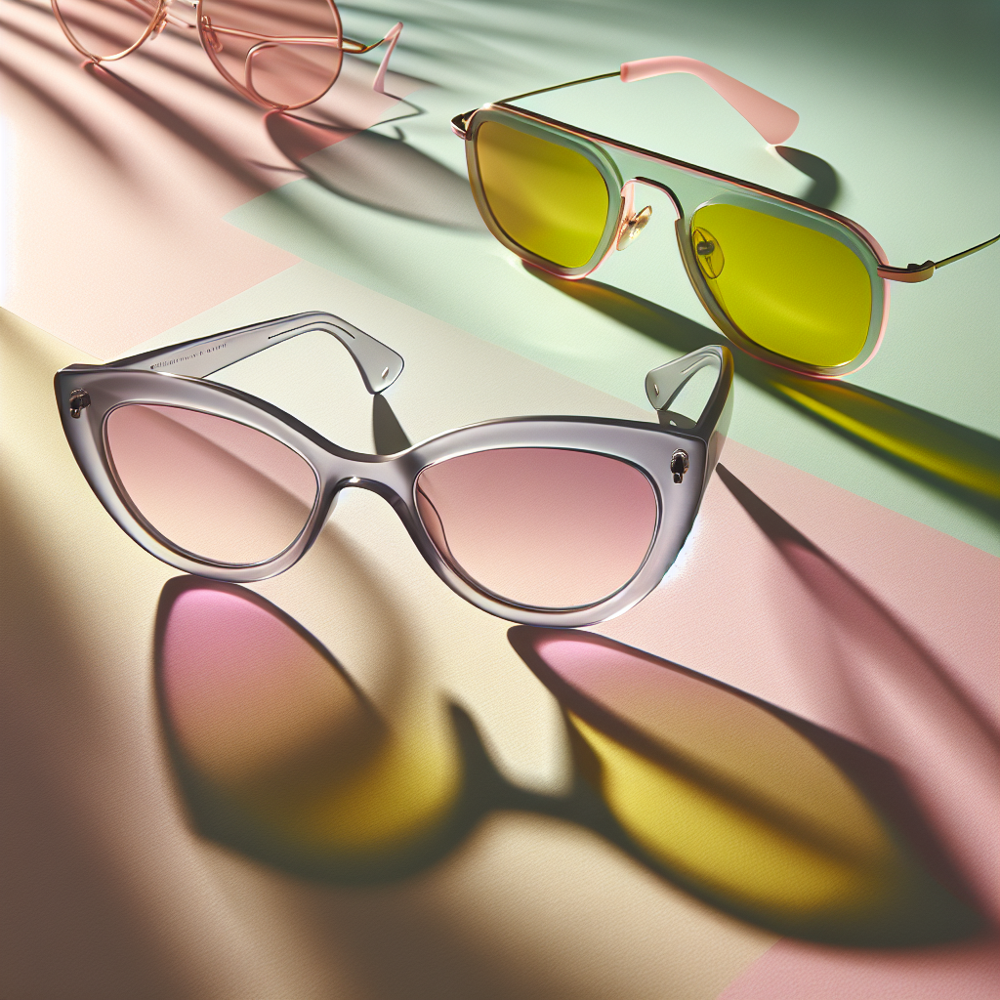

# 🕶️ Summer Sunglasses Campaign – Executive Summary

## 📊 Refined Trend Insights
Executive Summary  
For Summer 2025, we propose a focused sunglasses campaign that captures three core trends—pastel-tinted minimalism, ’60s-inspired sculptural frames, and performance-driven wraparounds. By positioning Mystique (SG003) and Sport (SG004) as our hero styles, supported by the high-volume Aviator (SG001), we deliver exclusivity, momentum, and scale in one cohesive effort.

Key Trends  
- Tinted-Lens Minimalism  
  Light pastel washes (pink, green, lavender) over classic shapes for subtle yet sophisticated appeal.  
- Sculptural ’60s Frames  
  Exaggerated cat-eye silhouettes with upswept corners and robust temples for a modern-feminine statement.  
- Technical Wraparounds  
  Streamlined single-lens or semi-shield designs with rubberized nose and grip details for active-luxe comfort.

Product Recommendations  
- Mystique (SG003)  
  A refined 1950s cat-eye with elegant upswept temples—perfect for limited-edition translucent tints. Inventory: 3 units (premium, exclusive).  
- Sport (SG004)  
  A sleek wraparound silhouette with rubber grips—ideal for bright summer palettes and mirrored finishes. Inventory: 11 units.  
- Aviator (SG001)  
  Iconic teardrop lenses in slender metal rims—ready for gradient pastels or light mirroring. Inventory: 23 units for broad distribution.

Strategic Fit  
- Mystique meets the surge in sculptural vintage frames with a couture-level look that remains wearable.  
- Sport answers demand for hybrid athleisure eyewear, blending performance cues with street-style cred.  
- Aviator bridges both oversized-metal and tinted-lens currents while leveraging a universally recognized, self-selling silhouette.

Campaign Execution  
Lead with Mystique and Sport as hero pieces, reinforced by Aviator as the versatile staple. This approach ensures we cover all major Summer 2025 eyewear currents—delivering a compelling, trend-forward portfolio that drives both brand prestige and volume.

## 🎯 Campaign Visual

    

## ✍️ Campaign Quote
Pastel Perfection: Sculptural Cat-Eyes & Active-Luxe Shades

## ✅ Why This Works
This phrase highlights the soft, pastel-tinted minimalism and dramatic ’60s-inspired cat-eye shape seen in the image, while nodding to the sporty, technical-chic wraparound style—perfectly aligning with the summer 2025 trends and hero pieces.

---

*Report generated on 2025-11-07*
